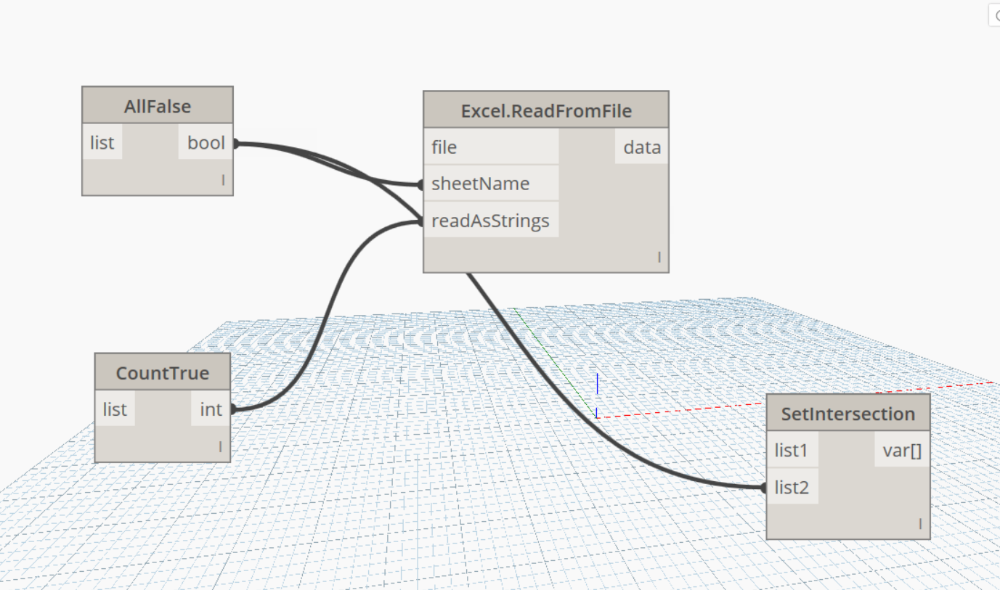
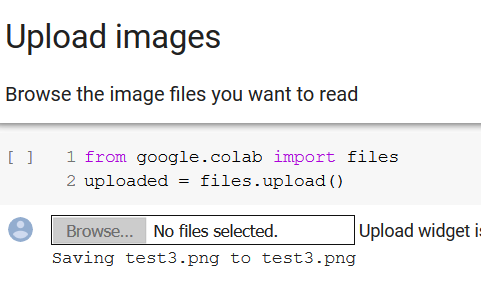
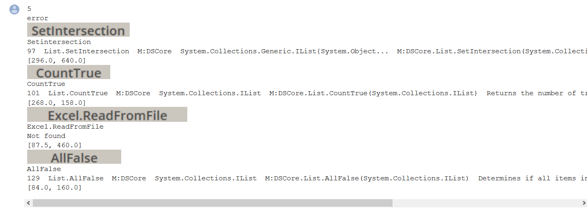

# DynamoOCR
This quarantine project is a concept for an OCR nodes detection tool for dynamo images.

*Based on [@60secondrevit]( https://twitter.com/60secondrevit/status/1196151641033936897) suggestion

### Known bugs

* Random errors in cv2 image process, for sure it's my fault
* Random results when images contains a lot of cables.

### TODO

* Format output
* Scrap most used libraries
* Link to specific libraries in dynamopackages.com
* Recreate a complete dynamo json dyn from the images provided.

## How to use it

Upload an image with the nodes you want to identify

Once the process it's done you will see a snapshot of the nodes title, the text inside the title and the name of the library the node belongs.

